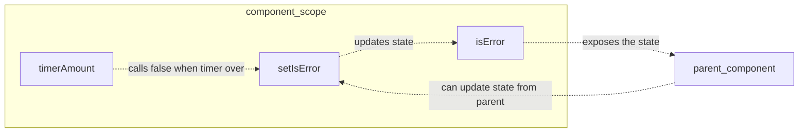

### Architecture



### Import

```ts
import { Error } from '@/ui';
```

### Props

<ParamField path="content" type="string" required={true}>
  This is the error message that will be displayed to the user
</ParamField>

<ParamField path="setIsError" type="void" required={true}>
  this is the setter that will control the `isError` state
</ParamField>

<ParamField path="isError" type="boolean" required={true}>
  This is the connected set state variable that is controlled by `setIsError`
</ParamField>

<ParamField path="height" default="25" type="number" required={false}>
  The expected line height of your error, (animations don't work on non-deterministic heights)
</ParamField>

<ParamField path="timerAmount" default="4000" type="number" required={false}>
  Controls how long the error is shown before hidden again
</ParamField>

### Example code

```ts
import { Error } from '@/ui';
import React, { useState} from 'react';


export const ExampleCard = ({
  content,
}) => {
  const [isError, setIsError] = usestate(false);

  return(
    <Error
      content={content}
      isError={isError}
      setIsError={setIsError}
      // we will rely on the default 40 height
    />
  )
}
```
